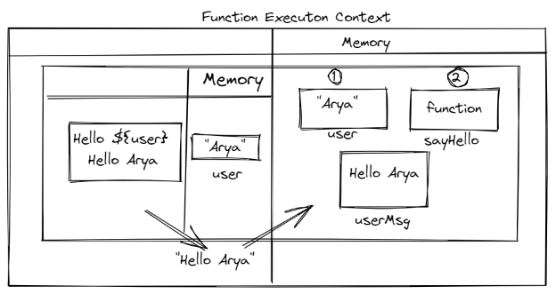
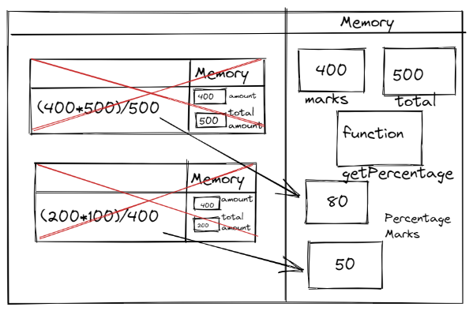
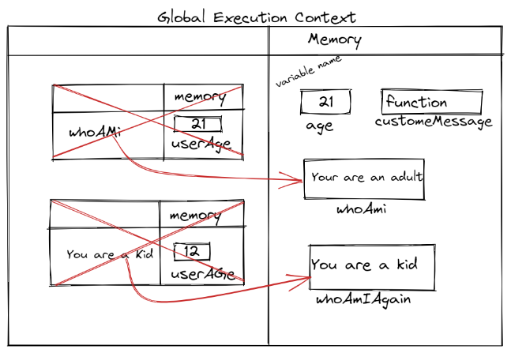

1. What does thread of execution means in JavaScript?
Ans:- Thread of execution in javascript means it will run the code one by one and give the output of function.
2. Where the JavaScript code gets executed?
Javascipt virtual machine it can execute the code on server or any device that has a special program called javscript engine 
3. What does context means in Global Execution Context?
when we call a function and created a new executed function that will be global execution context
4. When do you create a global execution context.
whenever its running our code its created by javscript engine .
5. Execution context consists of what all things?
it consists two things it gets created oce the program start and another is known as funcion execution context.
6. What are the different types of execution context?
Global and functional executon context global is default and functional is everytime a function is invoked brand new execution is created.
7. When global and function execution context gets created?
whenever its running our code its created by javscript engine .
8. Function execution gets created during function execution or while declaring a function.
Function execution gets created during function execution.

9. Create a execution context diagram of the following code on your notebook. Take a screenshot/photo and store it in the folder named `img`. Use `` to display it here.


```js
var user = "Arya";

function sayHello(){
  return `Hello ${user}`;
}

var userMsg = sayHello(user);
```

<!-- Put your image here -->




```js
var marks = 400;
var total = 500;

function getPercentage(amount, totalAmount){
  return (amount * 100) / totalAmount;
}

var percentageMarks = getPercentage(marks, total);
var percentageProfit = getPercentage(400, 200);
```

<!-- Put your image here -->




```js
var age = 21;

function customeMessage(userAge){
  if(userAge > 18){
    return `You are an adult`;
  }else {
    return `You are a kid`;
  }
}

var whoAmI = customeMessage(age);
var whoAmIAgain = customeMessage(12);
```

<!-- Put your image here -->

